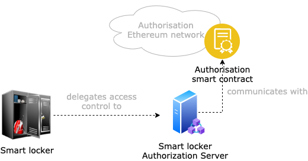

# SMAUG Smart Locker Owner (SLO) domain

The smart locker owner domain includes all the components that are under the control of the smart locker owner. Fig. 1 shows all the components that are deployed as part of the smart locker owner domain.

 
<i><b>Figure 1:</b> the architecture of the components that are under the control or trusted by the smart locker owner.</i>

The components in this domain are:

- **Smart locker**: it is the physical smart locker. It provides storage space and runs SMAUG-compliant software, which allows the locker to be discoverable over BLE and optionally NFC. For more details, check the [SMAUG smart locker IoT component description](sl-iot).
- **Smart locker authorization server**: it is the service that manages access to the smart locker. Specifically, it listens for blockchain events that are broadcasted by the Interledger agent on the authorization blockchain via the Interledger Proxy smart contract (explained above) and filters the relevant ones, i.e., the ones about requests that refer to one of the smart lockers under its control. Although a smart locker owner can deploy this server, it is more likely that the smart locker owner will delegate to some third-party the deployment and management of it. Potentially, that could be a different authorization server for each smart locker, but more realistically there would be an authorization server for all the smart lockers of one or more smart locker owners. For more details, check the [SMAUG smart locker authorization server blockchain agent description](sl-as-blockchain-agent) and the [SMAUG smart locker authorization server PDS description](sl-as-pds).
- **Authorization smart contract**: it is the smart contract that the smart locker authorization server uses to log the generated smart contracts. This log is useful in cases of dispute resolution, to prove that a given access token was issued at a specific time. It is deployed in combination with the authorization server, hence managed by the same entity. Once a set of access tokens have been logged, the authorization server can trigger the Interledger process to transfer the tokens to the marketplace blockchain. This happens with the authorization smart contract calling the method to trigger the Interledger on the Interledger proxy smart contract. For more details, check the [authorization server smart contracts description](sl-as-smart-contracts).