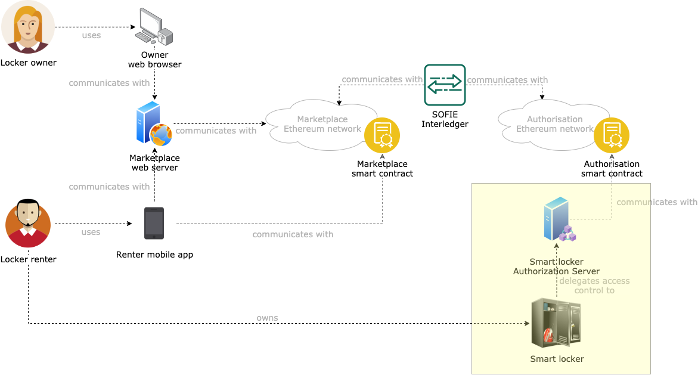

# SMAUG Smart Locker Authorization Server Privacy and Data Sovereignty

This component is a deployment of the [SOFIE Privacy and Data Sovereignty (PDS) component](https://github.com/SOFIE-project/Privacy-and-Data-Sovereignty). The goal of this component is to generate new access tokens to access a set of smart lockers, and to log those tokens on a smart contract running on the authorization Ethereum blockchain (see the [SMAUG deployment repository](https://github.com/SOFIE-project/SMAUG-Deployment) for additional details).

## Architecture

A representation of where this component fits in the SMAUG architecture is presented below.

## Deployment

For instructions on how to deploy this component, see the [SOFIE Privacy and Data Sovereignty (PDS) repository](https://github.com/SOFIE-project/Privacy-and-Data-Sovereignty).