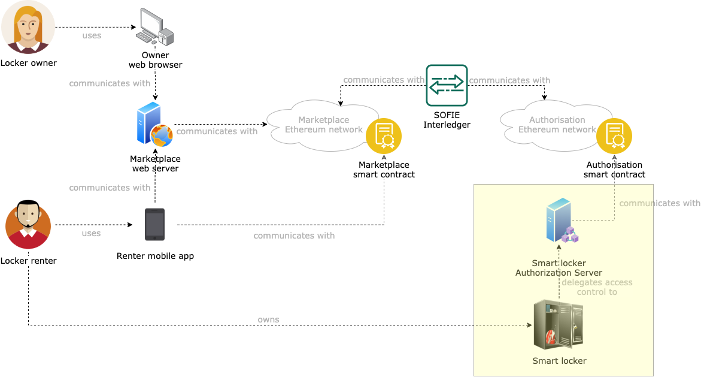

# SMAUG Smart Locker Authorization Server Smart Contract

This component is a deployment of the [SOFIE Privacy and Data Sovereignty (PDS) smart contract](https://github.com/SOFIE-project/Privacy-and-Data-Sovereignty/blob/master/contract/PDS.sol). The goal of this component is to generate permanently log access tokens for smart locker access on the authorization Ethereum blockchain (see the [SMAUG deployment repository](https://github.com/SOFIE-project/SMAUG-Deployment) for additional details).

## Architecture

A representation of where this component fits in the SMAUG architecture is presented below.


## Smart contract API

Upon deployment on the authorization blockchain, the Smart Locker Authorization Server Smart Contract (SL AS SC for short) is linked to the [SMAUG Interledger proxy smart contract](https://github.com/SOFIE-project/SMAUG-Marketplace/tree/master/il-smart-contracts), which is responsible to trigger Interledger events from the authorization blockchain to the marketplace blockchain (see the [SMAUG deployment repository](https://github.com/SOFIE-project/SMAUG-Deployment) for additional details).

Hence, the constructor of the SL AS SC is defined as follows:

```javascript
constructor (address interledgerAddress) public;
```

Furthermore, the SL AS SC extends the functionalities of the [SOFIE Privacy and Data Sovereignty (PDS) smart contract](https://github.com/SOFIE-project/Privacy-and-Data-Sovereignty/blob/master/contract/PDS.sol), specifically:

```javascript
    contract PDS is Ownable {
        event token_added (bytes indexed metadata, uint index);
        function new_token(bytes memory metadata, bytes memory enc_token) public onlyOwner;
        function get_token(uint index) public view returns (bytes memory metadata, bytes memory enc_token);
    }
```

In addition to the functionalities provided by the PDS smart contract, the SL AS SC exposes the following APIs:

```javascript
    contract InterledgerCapablePDS is PDS {
        function changeInterledgerSmartContractAddress(address newAddress) public onlyOwner;        // Changes the address of the Interledger Proxy smart contract. Only the deployer (the owner) can call this function.
        function getInterledgerSmartContractAddress() public view returns (address);        // Returns the address of the linked Interledger Proxy smart contract.
        function advertiseTokens(uint[] memory tokenIndices) public onlyOwner;      // Builds the Interledger payload with the access tokens at the indices specified and calls the method on the Interledger Proxy smart contract to trigger the Interledger process.
    }
```

## Deployment

### Fresh start

When the project is cloned for the first time, run `npm install`. This will install all the needed `npm` dependencies, as well as generate all the [Typechain](https://github.com/ethereum-ts/TypeChain) typescript bindings needed for development.

## Compile the smart contracts

From the root of the project, run `npm run build` to compile the smart contracts and their typescript typings.

## Migrate the smart contracts

Migration represents the process of deploying smart contracts on a target blockchain.

> The SMAUG PDS smart contract needs to interact with the [Interledger smart contract](https://bitbucket.org/sofie-lmf/il-smart-contracts/src/master/) to trigger interledger events. For this reason, the Interledger smart contract needs to be deployed on some blockchain before migrating and deploying the smart contract in this repository.

### Run a migration

Assuming the blockchain development provided in the Interledger repository is used, then a migration can be performed by running `npm run migrate:authorisation -- --il-address <IL_SMART_CONTRACT_ADDRESS>`. where the address of the Interledger smart contract can be retrieved from that repository.

If another blockchain network is to be used, then the command to execute will also need to include the name of that blockchain: `npm run migrate -- --network <NETWORK_NAME> --il-address <IL_SMART_CONTRACT_ADDRESS>`.

## Test the smart contracts

Run `npm run test` from the root of the project. Ignore any typescript-related errors that might be generated on the console.